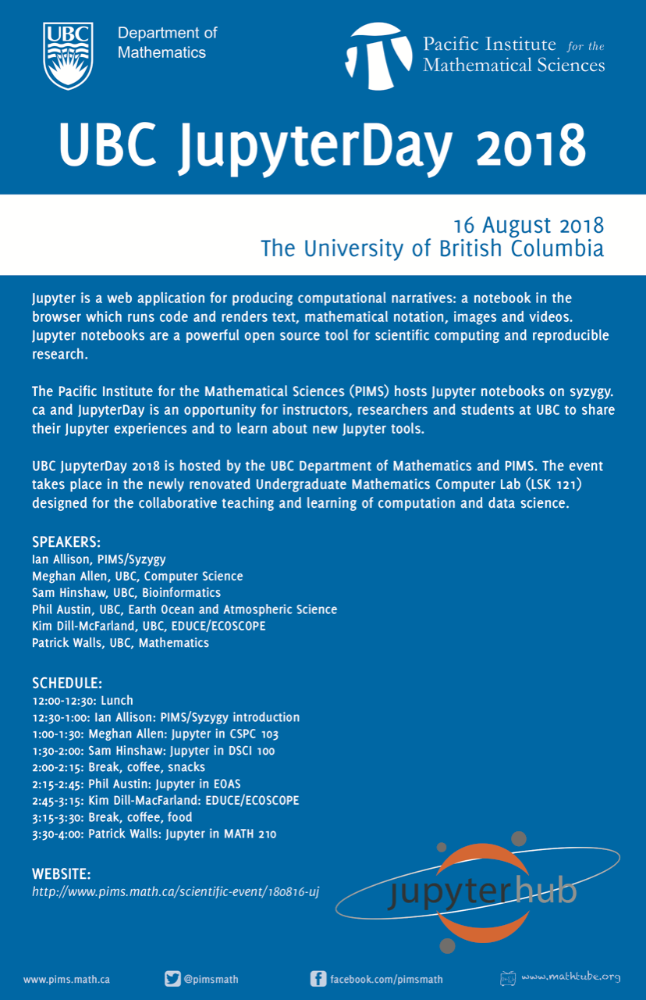

# UBC JupyterDay 2018

[Jupyter](http://jupyter.org/) is web application for producing computational narratives: a notebook in the browser which runs code and renders text, mathematical notation, images and videos. Jupyter notebooks are a powerful open source tool for scientific computing and reproducible research.

[The Pacific Institute for the Mathematical Sciences (PIMS)](http://www.pims.math.ca/) hosts Jupyter notebooks on [syzygy.ca](http://syzygy.ca/) and JupyterDay is an opportunity for instructors, researchers and students at UBC to share their Jupyter experiences and to learn about new Jupyter tools.

[UBC JupyterDay 2018](http://www.pims.math.ca/scientific-event/180816-uj
) is hosted by the [UBC Department of Mathematics](http://www.math.ubc.ca/) and [PIMS](http://www.pims.math.ca/). The event takes place in the newly renovated Undergraduate Mathematics Computer Lab (LSK 121) designed for the collaborative teaching and learning of computation and data science.

* Thursday August 16, 2018
* 12-4pm
* Undergraduate Mathematics Computer Lab, LSK 121
* See [PIMS event page](http://www.pims.math.ca/scientific-event/180816-uj)

| | |
|:---:|:---:|
| 12:00-12:30 | Lunch |
| 12:30-1:00 | [Ian Allison: PIMS/Syzygy introduction](allison/Canadians-land-on-Jupyter-Presentation.pdf) and [Patrick Walls: Welcome to JupyterDay](walls/jupyterday.ipynb) |
| 1:00-1:30 | [Meghan Allen: Jupyter in CSPC 103](allen/Jupyter_Day_2018_CPSC_103.pdf) |
| 1:30-2:00 | [Sam Hinshaw: Jupyter in DSCI 100](hinshaw/2018-08-16-canvas-jupyterhub-presentation.pdf) |
| 2:00-2:15 | Break, coffee, food |
| 2:15-2:45 | [Phil Austin: Jupyter in EOAS](austin/Austin_Jupyter_Aug_2018_talk.ipynb) |
| 2:45-3:15 | [Kim Dill-McFarland: EDUCE/ECOSCOPE](dill-mcfarland/2018_JupyterDay_EDUCE.pdf) |
| 3:15-3:30 | Break, coffee, food |
| 3:30-4:00 | [Patrick Walls: Jupyter in MATH 210](jupyter_math210.ipynb) |

